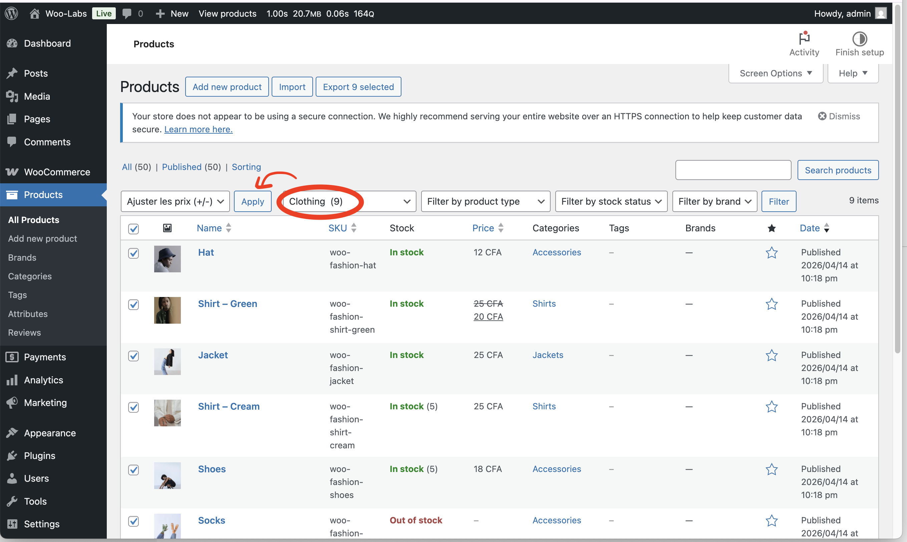
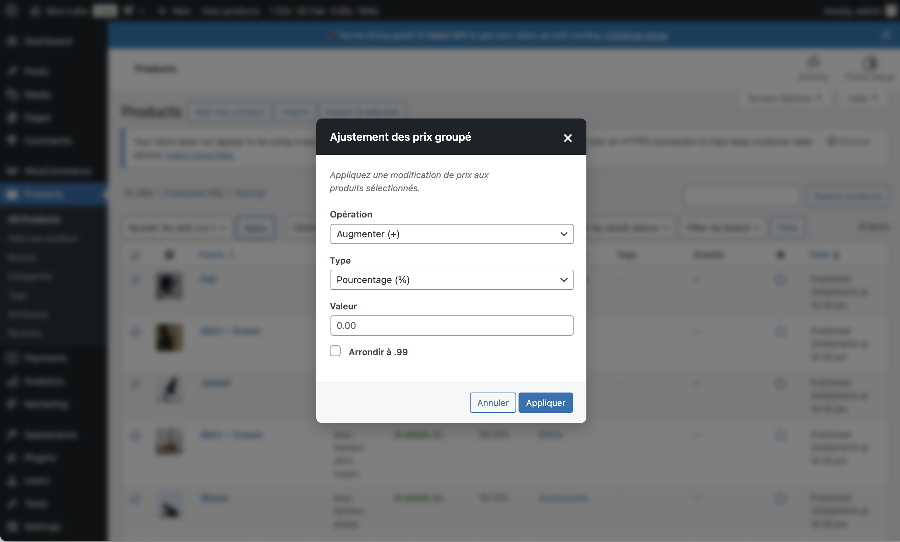

# Wiki Utilisateur - Woo Tweaks Tools

Bienvenue dans la documentation d'utilisation du plugin **Woo Tweaks Tools**. Ce guide vous explique comment configurer et utiliser les différentes fonctionnalités.

## Accès aux Réglages
Rendez-vous dans votre tableau de bord WordPress > **WooCommerce** > **Réglages** > Onglet **Woo Tweaks**.
Vous y trouverez tous les modules disponibles répartis dans une interface claire en deux colonnes.

---

## Fonctionnalités (Modules)

### 1. Personnalisation des Boutons (Custom Labels)
Modifiez le texte "Ajouter au panier" sur vos fiches produits selon le type de produit.
- *Exemple* : Remplacez "Ajouter au panier" par "Réserver" ou "Acheter maintenant".

### 2. Bouton "En Savoir Plus" (Read More Button)
Ajoute un bouton de redirection vers la page produit complète depuis les archives de la boutique.
- **Thèmes Legacy** : Ajouté automatiquement.
- **Thèmes FSE (Full Site Editing)** : Utilisez le bloc natif "Read More (by WooTweaks)" directement dans l'éditeur de site (Gutenberg).
- **Options avancées** :
    - Ouverture dans un nouvel onglet (`target="_blank"`).
    - Affichage sur la fiche produit (Single Product) pour faciliter la navigation transversale.

### 3. Redirection Panier Vide (Empty Cart Redirect)
Redirige automatiquement un visiteur accédant à la page Panier si celui-ci est vide. Il sera redirigé vers la page principale de la boutique.

### 4. Nettoyage de la Caisse (Checkout Fields Cleaner)
Allège le formulaire de commande en masquant les champs non essentiels.
- Champs supprimés : Nom de l'entreprise, Adresse ligne 2, Téléphone, Notes de commande.

### 5. Styles Personnalisés (Custom CSS Engine)
Une interface dédiée à droite de vos réglages vous permet d'ajouter du code CSS personnalisé.
- Pratique pour surcharger le design d'un module sans toucher aux fichiers du thème.
- Un mini-glossaire des classes est inclus sous l'éditeur pour vous guider (ex: `a.woo-tweaks-read-more`).

### 6. Masquage des Éléments (Hide Components)
Masquez sélectivement le SKU, les catégories ou les produits apparentés sur les thèmes classiques.
- **Note** : Inactif sur les thèmes FSE pour laisser le plein contrôle à l'éditeur de site.

### 7. Ajustement de Prix (Bulk Price Manager)
Modifiez vos prix en masse directement depuis la liste des produits WooCommerce sans passer par des réglages complexes.
- **Accès** : Liste des produits WooCommerce.
- **Fonctionnement** :
    1. Filtrez vos produits par catégorie, type ou état de stock.
    2. Sélectionnez les produits concernés (case à cocher).
    3. Choisissez **Actions groupées** > **Ajuster les prix (+/-)**.
    
    4. Une fenêtre surgissante (modal) s'affiche pour configurer l'ajustement.
    
- **Options disponibles** :
    - **Opération** : Augmenter ou Diminuer le prix.
    - **Type** : Valeur fixe (ex: +5€) ou Pourcentage (ex: -10%).
    - **Arrondi Intelligent** : Option pour arrondir automatiquement tous les prix à `.99` (ex: 12.43€ devient 12.99€).
- **Confirmation** : Un message de succès indique le nombre exact de produits mis à jour.

### 8. Achat Direct (Direct Checkout)
Ajoute un bouton secondaire "Acheter maintenant" à côté du bouton "Ajouter au panier".
- **Bénéfice** : Supprime l'étape intermédiaire du panier pour augmenter le taux de conversion sur des achats immédiats.
- **Personnalisation** : Vous pouvez modifier le texte du bouton (ex: "Commander", "Flash Buy") dans les réglages du module.
- **Thèmes Legacy** : Le bouton s'ajoute automatiquement sur la fiche produit.
- **Thèmes FSE** : 
    - Utilisez le bloc "Direct Checkout (Woo Tweaks)" depuis l'éditeur de site.
    - Fonctionne aussi bien sur la **fiche produit** que dans les **archives** (Boutique/Catégories) grâce à une détection automatique de l'article concerné.

---

*Ce document est mis à jour à chaque nouvelle fonctionnalité ajoutée au plugin.*
